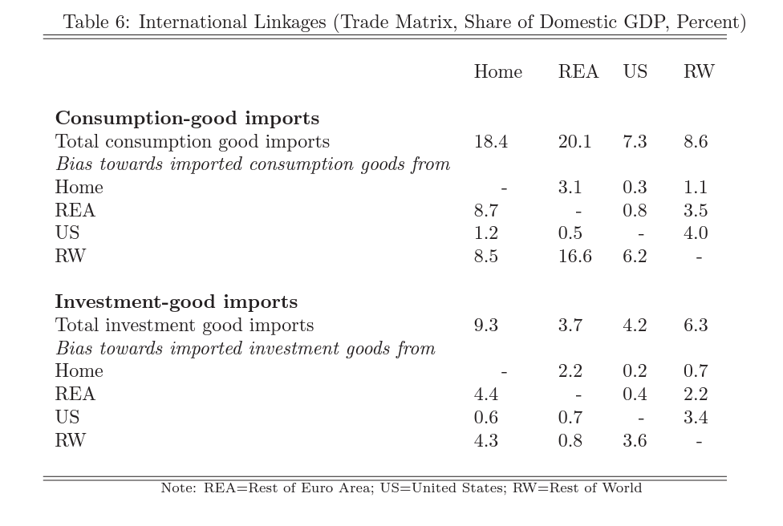
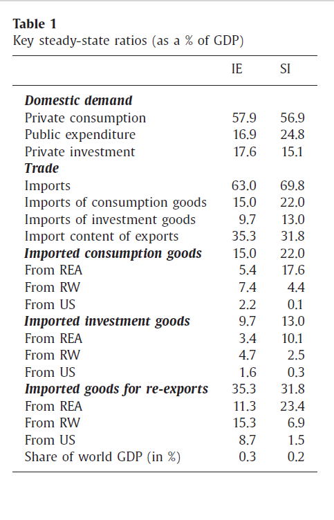
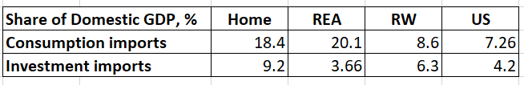
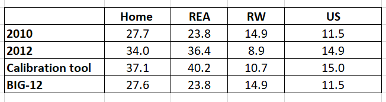

# Trade matrix calibration: overview of the import parameters used in previous EAGLE versions
## Gomes et al. (2010)
### Comment
Four regions: Germany, rest of Euro area, US, Rest of World. Split into consumption and investment imports, expressed in percentage of GDP. Trade is calibrated using Eurostat and IMF statistics - the paper does not expand further on data sources. 
### Import values 

## Gomes et al. (2012)
### Comment
The steady-state trade-balance ratio
(to GDP) is exogenously pinned-down, given the calibrated import
shares, net foreign asset position and international interest rate. Export
and import quantities as well as international relative prices consistently
adjust. 

Uses the same methodology as 2010 paper, but the mismatch between the two papers might be due to usage of updated data for share of imports as percentage of GDP. 
Data for matching the main economic ratios of the regions are taken from the IMF World Economic Outlook database.
### Import values 

## EAGLE calibration tool 

### Comment 
Block 1: DE \
Block 2: FR \
Block 3: IT \
Block 4: Rest of Euro Area \
Block 5: US 

The block to block import shares for goods are computed from OECD STAN data. 

Data on shares of imports of goods by block is augmented with the data on imports of
services from balance of payments data (Eurostat) by weighting goods and services in
terms of their share in imports in national accounts.

### Import values 

## Clency et al. (2016)
### Comment 
Available only for Ireland and Slovenia.

The parameters governing the trade linkages between the model blocs are based on a mix of national accounts data (for the volume of trade) and input-output tables (for the composition, consumption or investment, of traded goods and the bilateral components of trade) available from the countries’ respective national statistical agencies. The remaining parameters in the model are either based on country-specific empirical evidence, where available, or kept consistent with the original model which uses standard values, prevalent in the literature (see Gomes et al. (2012) ).

### Import values 

## 12 country model 
### Comment 
Taken from the 2010 original paper. Later weighted by country size to disaggregate into 12 regions.

### Import values 

### Data description and sources

## Comparison between models 

Possible reasons for mismatch could be inclusion of services imports in the calibration tool calculations, usage of different years of data, mismatch between methodologies for accounting for re-exports.